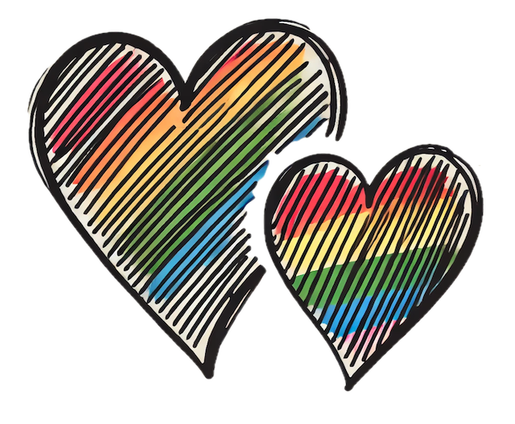

# Queer Conceptions 

### Overview
**Queer Conceptions** is part of a larger initiative designed to support LGBTQ+ families navigating their family planning journey. The app provides personalized support through a conception plan generator, virtual doula, and tailored resources. It aims to simplify the complex and often overwhelming process of conception for LGBTQ+ individuals. The app guides users step by step, whether they are considering IVF, surrogacy, sperm/egg donation, or other family-building options.

### Features
- **User Login/Signup:**
Users can create an account or log in securely, allowing them to save and track their personalized conception plans.
- **AI-Generated Conception Plan:**
Based on user input (e.g., method choice, legal/medical needs, timeline), an AI generates a personalized plan, helping users stay organized and progress through their conception journey.
- **Resource Library:**
Users can access a library of relevant resources, including LGBTQ+-inclusive medical and legal information.
- **Virtual Doula Chatbot:**
A virtual doula chatbot provides users with real-time assistance for frequently asked questions regarding conception and family planning, using AI to ensure responses are tailored and informative. Users can ask questions about legal, medical, and emotional aspects of conception, and receive empathetic, comprehensive answers.

### Stretch Goals 
**User Dashboard:** Implement a dashboard for tracking progress over time.

**Community Forum:** Add a feature where users can interact, share experiences, and support each other.

**Expanded AI Capabilities:** Develop AI capabilities further to answer more specific legal and medical questions.

### Technologies

### Usage
Once users sign up or log in, they can generate a personalized conception plan by answering a few questions about their family-building preferences. The conception planner offers AI-driven guidance that is tailored to individual needs, providing users with step-by-step instructions and resources. The virtual doula chatbot can be accessed for real-time answers to common questions, offering support throughout the journey.

How to use Queer Conceptions:

1. Sign Up: Create an account to get started.

2. Generate a Plan: Fill out the conception form to receive a customized plan.

3. Chatbot Assistance: Access the virtual doula chatbot for guidance and information.

4. Resource Library: Explore resources tailored to LGBTQ+ individuals and families.

### Preview

### Setup

To run this project locally, follow these steps:

Clone the repository:

`git clone git@github.com:MBHunter88/queer_conceptions.git
cd queer_conceptions`

Run the setup script:

`./scripts/local_setup.sh`

This script installs dependencies, copies example environment files, and runs the initial database migration. After it completes, edit `server/.env` and `client/.env` with your real values.

Start the backend server:

`npm start --prefix server`

Start the development server:

`npm run dev --prefix client`

Open your browser and go to `localhost`.

### Acknowledgments
I want to thank the following individuals and organizations for their invaluable support and contributions to this project:

**The Techtonica Staff:** For providing the platform and resources to help me grow as a software developer.

**My Mentor:** For guiding me through complex technical challenges and providing invaluable insights.

**My Collaborators:** For their enthusiasm and efforts in making this project a success.

**My Wife:** For her unwavering support and encouragement throughout this journey.

Special thanks to the LGBTQ+ community for inspiring this project and guiding its development through invaluable feedback.